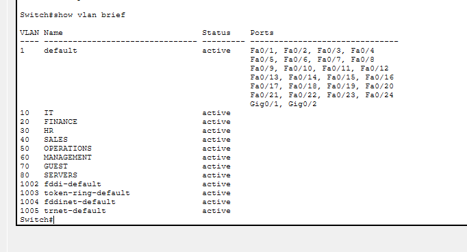
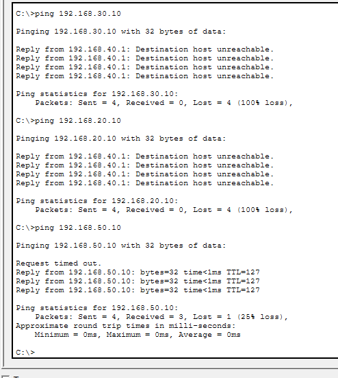
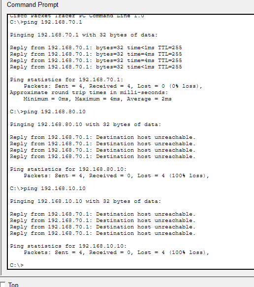
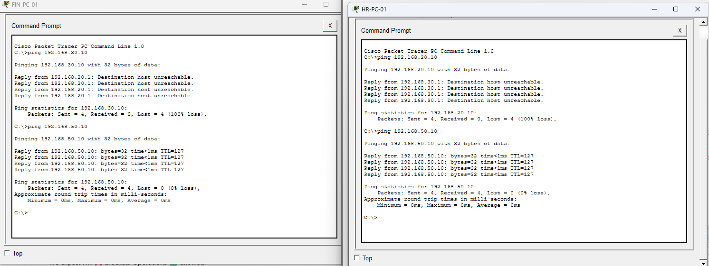
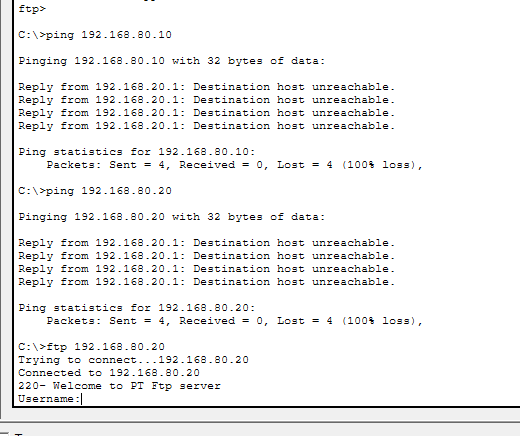
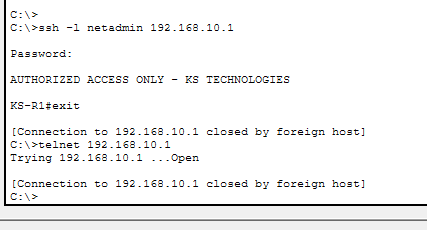
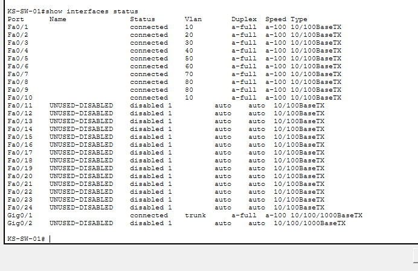

# KS Technologies - Network Security Design

## Objective

Design a segmented and secure network for KS Technologies that separates departments, protects sensitive systems, limits unnecessary access between networks, and provides isolated guest connectivity.

## VLAN Design

| VLAN | Department | Subnet | Gateway |
|---|---|---|---|
| 10 | IT | 192.168.10.0/24 | 192.168.10.1 |
| 20 | Finance | 192.168.20.0/24 | 192.168.20.1 |
| 30 | HR | 192.168.30.0/24 | 192.168.30.1 |
| 40 | Sales | 192.168.40.0/24 | 192.168.40.1 |
| 50 | Operations | 192.168.50.0/24 | 192.168.50.1 |
| 60 | Management | 192.168.60.0/24 | 192.168.60.1 |
| 70 | Guest Wi-Fi | 192.168.70.0/24 | 192.168.70.1 |

## Inter-VLAN Access Control

KS Technologies follows the principle of least privilege. VLANs are isolated by default, and communication between VLANs is only permitted where there is a legitimate business requirement.

| Source VLAN | Destination | Access | Reason |
|---|---|---|---|
| IT (10) | Internal VLANs | Restricted Admin Access | IT requires approved management access but should not have unrestricted connectivity |
| Finance (20) | HR (30) | Deny | No normal business requirement |
| HR (30) | Finance (20) | Deny | No normal business requirement |
| Sales (40) | HR (30) | Deny | Protect sensitive employee information |
| Sales (40) | Finance (20) | Deny | Protect financial information |
| Guest (70) | Internal VLANs | Deny | Guest devices must be isolated from corporate systems |
| Guest (70) | Internet | Allow | Internet-only guest connectivity |

| 80 | Servers | 192.168.80.0/24 | 192.168.80.1 |

## Server Addressing

Critical servers use static IP addresses to provide predictable and reliable connectivity.

| Server | Role | IP Address |
|---|---|---|
| KS-DC-01 | Domain Controller | 192.168.80.10 |
| KS-FS-01 | File Server | 192.168.80.20 |

## Network Implementation

The KS Technologies network was implemented and tested using Cisco Packet Tracer.

The network uses a router-on-a-stick design, with KS-R1 providing inter-VLAN routing through 802.1Q subinterfaces. KS-SW-01 provides connectivity for departmental endpoints and servers.

The following VLANs were implemented:

- VLAN 10 - IT
- VLAN 20 - Finance
- VLAN 30 - HR
- VLAN 40 - Sales
- VLAN 50 - Operations
- VLAN 60 - Management
- VLAN 70 - Guest
- VLAN 80 - Servers

A trunk connection between KS-SW-01 and KS-R1 carries traffic for all configured VLANs.

## Security Controls Implemented

### Inter-VLAN Access Control

Extended ACLs were configured on KS-R1 to enforce least-privilege communication between network segments.

Controls include:

- Sales is blocked from directly accessing HR and Finance.
- HR and Finance are blocked from directly accessing each other's VLANs.
- Guest devices are isolated from all internal corporate VLANs.
- Guest devices retain connectivity to their own gateway and are designed for Internet-only access.
- Finance access to the server VLAN is restricted to an authorised service.

### Server Access Control

KS Technologies uses VLAN 80 as a dedicated server network.

- KS-DC-01: 192.168.80.10
- KS-FS-01: 192.168.80.20

Finance was configured with access to the simulated FTP service on KS-FS-01 using TCP port 21 while general access to the server VLAN was denied.

A restricted Finance account was configured with Read and List permissions. Attempts to delete files were denied, demonstrating least-privilege access at both the network and application layers.

FTP is used only for demonstration within the Packet Tracer lab. A production environment would use an encrypted file-transfer or file-sharing solution.

### Privileged IT Administration

Administrative access to the server VLAN is restricted to a designated IT administrative workstation.

- IT-ADMIN-01 (192.168.10.10) - Server VLAN access permitted
- Standard IT workstation (192.168.10.20) - Server VLAN access denied

Testing confirmed that the standard IT workstation retained normal permitted network connectivity while being unable to access the protected server VLAN.

### Network Device Hardening

KS-R1 and KS-SW-01 were hardened to reduce the network management attack surface.

Controls implemented include:

- SSH version 2 for encrypted remote administration
- Telnet disabled
- Local privileged administrator account
- Encrypted stored credentials
- Login security banner
- Five-minute idle session timeout
- 2048-bit RSA keys
- Dedicated switch management interface on VLAN 60
- Switch management access restricted to IT-ADMIN-01
- Unused switch ports administratively disabled

## Testing and Validation

The implemented security controls were tested in Cisco Packet Tracer to verify both permitted and denied network traffic.

### VLAN and Routing Validation

- Confirmed all eight VLANs were active on KS-SW-01.
- Verified the 802.1Q trunk between KS-SW-01 and KS-R1.
- Confirmed router subinterfaces were operational for each VLAN.
- Successfully tested endpoint-to-gateway connectivity.

### Access Control Testing

Testing confirmed that:

- Sales could initially reach HR before ACL implementation.
- After applying the Sales ACL, access to HR and Finance was blocked while permitted access to Operations remained available.
- HR and Finance were unable to communicate directly with each other.
- Guest devices were unable to access corporate networks or the server VLAN.
- Finance could access the authorised FTP service on KS-FS-01 while general access to VLAN 80 was blocked.
- The Finance FTP account could list and read files but could not delete files.
- IT-ADMIN-01 could access the server VLAN.
- A standard IT workstation on the same VLAN could not access the server VLAN.

### Management Security Testing

Remote administration controls were also validated:

- SSH v2 connections to KS-R1 were successful.
- Telnet connections to KS-R1 were rejected.
- KS-SW-01 could be managed through its dedicated VLAN 60 management interface.
- Remote switch management was restricted to IT-ADMIN-01.
- Unused switch interfaces were verified as administratively disabled.

## Key Security Concepts Demonstrated

This project demonstrates practical implementation of:

- Network segmentation using VLANs
- 802.1Q trunking
- Inter-VLAN routing
- Extended and standard ACLs
- Least-privilege network access
- Guest network isolation
- Service-level access control
- Privileged administrative workstation separation
- SSH-based secure administration
- Management-plane access control
- Network device hardening
- Attack-surface reduction
- Security control testing and validation

## Evidence

### VLAN Configuration

### Inter-VLAN Access Control

### Guest Network Isolation

### HR and Finance Isolation

### Service-Level Access Control

### Secure Remote Administration

### Switch Port Hardening
